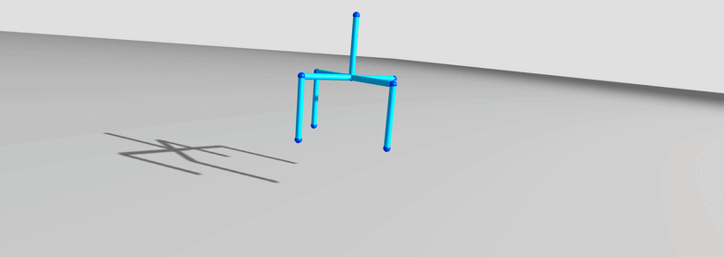

## [DisMech: A Discrete Differential Geometry-based Physical Simulator for Soft Robots and Structures](http://dismech.github.io/)

<div style="text-align: center;">
<table>
  <tr>
    <td align="center">    <br>
      <em>Logo </em>
      </td>
    <td align="center">    <br>
      <em>Spider robot dropped onto an incline </em>
    </td>


  </tr>


   <tr>
      <td align="center" rowspan="2">
         <br>
        <em> Active entanglement gripper </em>
     </td>
      <td align="center">   <br>
            <em> Helix oscillating under gravity </em>
      </td>
   </tr>
   <tr>
      <td align="center">   <br>
           <em> Real2Sim soft manipulator modelling </em>
      </td>
   </tr>
</table>
</div>


[DisMech](http://dismech.github.io/) is a discrete differential geometry-based physical simulator for elastic rod-like structures and soft robots.
Based on the [Discrete Elastic Rods](https://www.cs.columbia.edu/cg/pdfs/143-rods.pdf) framework, it can be used to simulate soft structures for a wide variety of purposes such as robotic deformable material manipulation and soft robot control.

***

### TODO
If you'd like DisMech to support a new feature, feel free create an issue and we'll add it to the list here.

#### High priority
- [ ] Improve robustness of friction.
- [ ] Add a more sophisticated renderer.
- [ ] Add contact logic for joints.
- [ ] Add URDF functionality for instantiating robot.
- [ ] Add shell functionality.
- [ ] Add knot tying case.

#### Low priority
- [ ] Possibly replace floor contact force (currently uses IMC) with modified mass method. 
- [ ] Add detailed documentation for all examples.
- [ ] Add more code examples for initializing limbs and joints.
- [ ] Add time varying boundary condition logic.
- [ ] Add more controller types.

### COMPLETED
- [x] Add per-limb friction coefficient logic. PR [#5](https://github.com/StructuresComp/dismech-rods/pull/5)
- [x] Add active entanglement example code.
- [x] Add limb self-contact option.
- [x] Add forward Euler integration scheme.
- [x] Add contact logic for limbs.
***

### Dependencies

There are some dependencies required prior to compilation.
Instructions for macOS and Ubuntu are similar (presented below).
For other operating systems you should be able to modify the commands below appropriately.

- **macOS**: Because this uses the MKL, it's not certain to run on Apple silicone.
- **macOS**: If you're running a mac, it's highly recommended you use a package manager like [MacPorts](https://www.macports.org/install.php) or [homebrew](https://brew.sh/). Instructions below are for MacPorts.
- **Note**: Some of these packages are installed to the system library for convenience. You may want to install locally to e.g., `~/.local` to avoid conflicts with system libraries. Add the `cmake` flag: `-D CMAKE_INSTALL_PREFIX=~/.local`. Then `sudo` is not required to install. You'll need to ensure subsequent builds know where to find the build libraries.

- X11
  - An X11 (xorg) server is necessary to use the `freeglut` library. This exists already on Linux.
  - **macOS**: This can be installed with MacPorts: `sudo port install xorg-server`. Then log out and back in.
- [Eigen 3.4.0](http://eigen.tuxfamily.org/index.php?title=Main_Page)
  - Eigen is used for various linear algebra operations.
  - **macOS**: You can install this version with MacPorts: `sudo port install eigen3`. Otherwise, build instructions are below.
  - DisMech is built with Eigen version 3.4.0 which can be downloaded [here](https://gitlab.com/libeigen/eigen/-/releases/3.4.0). After downloading the source code, install through cmake as follows.
    ```bash
    cd eigen-3.4.0 && mkdir build && cd build
    cmake ..
    sudo make install
    ```
    
- [Flexible Collision Library (FCL)](https://github.com/flexible-collision-library/fcl)
  - The FCL library is used to perform both broadphase and narrowphase collision detection with each discrete rod represented as a chain of cylinders.
  - FCL depends on both Eigen (instructions above) and [libccd](https://github.com/danfis/libccd). Install [libccd](https://github.com/danfis/libccd) with the following commands, making sure to build shared libraries:
     ```bash
    git clone https://github.com/danfis/libccd
    cd libccd
    cmake -G "Unix Makefiles" -DBUILD_SHARED_LIBS=ON ..
    make -j4
    sudo make install
     ```
  - Next, install FCL from source using the following commands:
    ```bash
    git clone https://github.com/flexible-collision-library/fcl
    cd fcl && mkdir build && cd build
    cmake ..
    make -j4
    sudo make install
    ```
- [SymEngine](https://github.com/symengine/symengine)
  - SymEngine is used for symbolic differentiation and function generation.
  - **macOS**: SymEngine with LLVM can be installed with MacPorts: `sudo port install symengine`.
  - Before installing SymEngine, LLVM is required which can be installed most easily via a package manager:
    - **Ubuntu**: `sudo apt-get install llvm`
    - **macOS**: `sudo port install llvm-15`
  - Afterwards, install SymEngine from source using the following commands:
    ```bash
    git clone https://github.com/symengine/symengine
    cd symengine && mkdir build && cd build
    cmake -D WITH_LLVM=on -D BUILD_BENCHMARKS=off -D BUILD_TESTS=off ..
    make -j4
    sudo make install
    ```
  - **macOS**: You'll need to provide the LLVM root to the build with `-D CMAKE_PREFIX_PATH=/opt/local/libexec/llvm-15` (if installed via MacPorts).
- [Intel oneAPI Math Kernel Library (oneMKL)](https://www.intel.com/content/www/us/en/developer/tools/oneapi/onemkl-download.html?operatingsystem=linux&distributions=webdownload&options=online)
  - Necessary for access to Pardiso, which is used as a sparse matrix solver.
  - Intel MKL is also used as the BLAS / LAPACK backend for Eigen.
  - **macOS**: Download from [Intel](https://www.intel.com/content/www/us/en/developer/tools/oneapi/onemkl-download.html) and use the install script.
  - **Ubuntu**: Follow the below steps.
    ```bash
    cd /tmp
    wget https://registrationcenter-download.intel.com/akdlm/irc_nas/18483/l_onemkl_p_2022.0.2.136.sh

    # This runs an installer, simply follow the instructions.
    sudo sh ./l_onemkl_p_2022.0.2.136.sh
    ```
  - Add one of the following to your .bashrc so that cmake can find the MKL library. Change the directory accordingly if your MKL version is different. 
   Note that older versions require setting `MKLROOT` while newer versions require `MKL_DIR`.
   You can find out which one from the cmake error message.
    ```bash
    export MKLROOT=/opt/intel/oneapi/mkl/2022.0.2   # for older versions
    export MKL_DIR=/opt/intel/oneapi/mkl/2024.2     # for newer versions
    ```

- [OpenGL / GLUT](https://www.opengl.org/)
  - OpenGL / GLUT is used for rendering the knot through a simple graphic.
  - Simply install through apt package manager:
    - **Ubuntu**: `sudo apt-get install libglu1-mesa-dev freeglut3-dev mesa-common-dev`
    - **macOS**: `sudo port install freeglut pkgconfig` (Note: `pkgconfig` is necessary to avoid finding system GLUT instead of `freeglut`.)

- Lapack (*included in MKL*)

***

### Running Examples
DisMech is setup so that simulation environments can be instantiated using a single cpp file called `robotDescription.cpp`.

Several example of working DisMech simulations can be seen in the `examples/` directory.
In order to run an example, copy the example cpp file into the main directory and then compile DisMech.
For example, using the cantilever beam example:

```bash
cp examples/cantilever_case/cantileverExample.cpp robotDescription.cpp
mkdir build && cd build
cmake ..
make -j4
cd ..
```
Afterwards, simply run the simulation using the `dismech.sh` script.
```bash
./dismech.sh
```
If you want to run another example, simply replace the `robotDescription.cpp` file and recompile.

***

### Creating Custom Simulation Environments
In case you want to create a custom simulation environment, take a look at the provided examples on how to do so.

Simulation parameters such as defining the soft structure(s) / robot(s), boundary conditions, forces, and logging are done solely in `robotDescription.cpp` so that large recompiles do not take place.

In addition, many numerical parameters can be set through the `simParams` struct shown below with default values and descriptions. Note that parameters with a `*` have additional explanations below. Parameters with a `^` only apply when an implicit numerical integration scheme is chosen and are otherwise ignored.
```c++
struct simParams {
  double sim_time = 10;                              //    Total time for simulation [s]
  double dt = 1e-3;                                  //    Time step size [s]
  bool render = true;                                //    Live OpenGL rendering
  bool show_mat_frames = false;                      //    Render material frames
  double render_scale = 1.0;                         //    Rendering scale
  double dtol = 1e-2;                                // *^ Dynamics tolerance [m/s]
  double ftol = 1e-4;                                // *^ Force tolerance
  int max_iter = 500;                                // ^  Maximum iterations for a time step
  int adaptive_time_stepping = 0;                    // *^ Adaptive time stepping
  int cmd_line_per = 1;                              //    Command line sim info output period
  bool enable_2d_sim = false;                        //    Lock z and theta DOFs
  bool line_search = true;                           // ^  Enable line search method
  numerical_integration_scheme nis = BACKWARD_EULER; // *  Numerical integration scheme 
  int debug_verbosity = 1;                           //    Prints certain debug statements 
};
```

Detailed parameter explanations:

- `numerical_integration_scheme` - Determines the numerical integration scheme. Currently, available options are 
  - `FORWARD_EULER`: https://en.wikipedia.org/wiki/Euler_method
  - `VERLET_POSITION`: https://en.wikipedia.org/wiki/Verlet_integration
  - `BACKWARD_EULER`: https://en.wikipedia.org/wiki/Backward_Euler_method
  - `IMPLICIT_MIDPOINT`: https://en.wikipedia.org/wiki/Midpoint_method
- `dtol` - A dynamics tolerance. Considers Newton's method to converge if the infinity norm of the DOF update divided by time step size for Cartesian positions is less than `dtol`: 
  $$\frac{|| \Delta \mathbf q ||_{\infty}} {\Delta t} < \textrm{dtol}$$
  Note that we ignore $\theta$ DOFs due to difference in scaling.
- `ftol` - A force tolerance. Considers Newton's method to converge if the cumulative force norm becomes less than the starting force norm * `ftol`.
  $$|| \mathbf f || < || \mathbf f_0 || * \textrm{ftol}$$
- `adaptive_time_stepping` - Turns on adaptive time stepping which halves the time step size if failure to converge after set number of iterations. Set to 0 to disable.

***
### Citation
If our work has helped your research, please cite the following paper.
```
@article{choi2023dismech,
    author={Choi, Andrew and Jing, Ran and Sabelhaus, Andrew P. and Jawed, Mohammad Khalid},
    journal={IEEE Robotics and Automation Letters}, 
    title={DisMech: A Discrete Differential Geometry-Based Physical Simulator for Soft Robots and Structures}, 
    year={2024},
    volume={9},
    number={4},
    pages={3483-3490},
    doi={10.1109/LRA.2024.3365292}
}

@article{choi2021imc,
    author = {Choi, Andrew and Tong, Dezhong and Jawed, Mohammad K. and Joo, Jungseock},
    title = "{Implicit Contact Model for Discrete Elastic Rods in Knot Tying}",
    journal = {Journal of Applied Mechanics},
    volume = {88},
    number = {5},
    year = {2021},
    month = {03},
    issn = {0021-8936},
    doi = {10.1115/1.4050238},
    url = {https://doi.org/10.1115/1.4050238},
}

@article{tong2022imc,
    author = {Dezhong Tong and Andrew Choi and Jungseock Joo and M. Khalid Jawed},
    title = {A fully implicit method for robust frictional contact handling in elastic rods},
    journal = {Extreme Mechanics Letters},
    volume = {58},
    pages = {101924},
    year = {2023},
    issn = {2352-4316},
    doi = {https://doi.org/10.1016/j.eml.2022.101924},
    url = {https://www.sciencedirect.com/science/article/pii/S2352431622002000},
}
```

***
### Acknowledgements
This material is based upon work supported by the National Science Foundation. Any opinions, findings, and conclusions or recommendations expressed in this material are those of the author(s) and do not necessarily reflect the views of the National Science Foundation.
