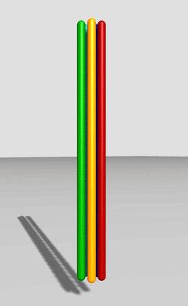

.. DisMech documentation master file, created by
   sphinx-quickstart on Thu Dec 21 18:41:35 2023.
   You can adapt this file completely to your liking, but it should at least
   contain the root `toctree` directive.

Welcome to DisMech's documentation!
===================================

.. mdinclude:: intro.md

.. image:: _static/spider_incline.gif
  :width: 800
  :alt: Spider robot dropped onto an incline
  :align: center

.. image:: _static/real2sim.gif
  :width: 800
  :alt: Real2Sim soft manipulator modelling
  :align: center

==================

.. toctree::
   :maxdepth: 1
   :caption: Contents

   install_instructions
   classlist
   filelist
   structlist
   namespacelist
   todo
   citation_acknowledgement

=========================

Indices and tables
==================

* :ref:`genindex`
* :ref:`modindex`
* :ref:`search`
